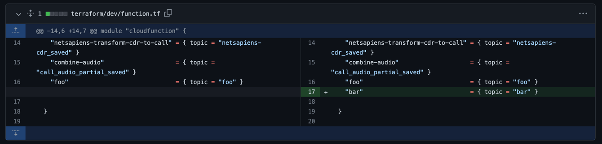
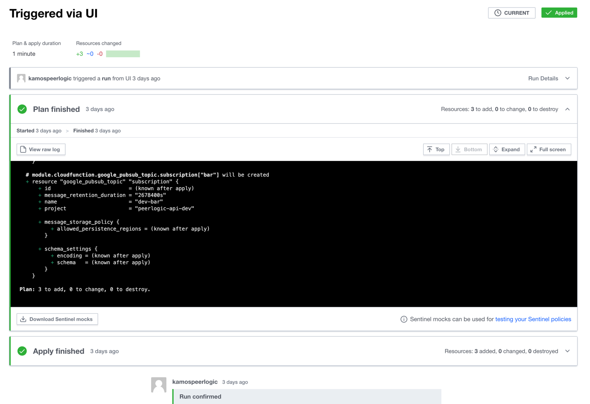
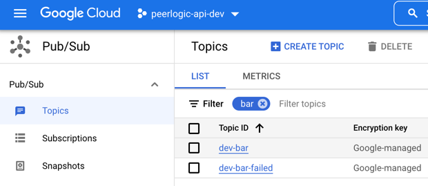
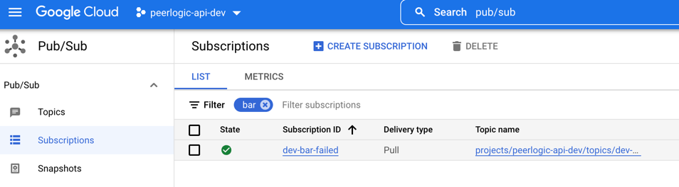
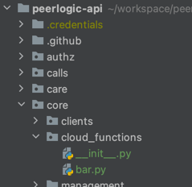
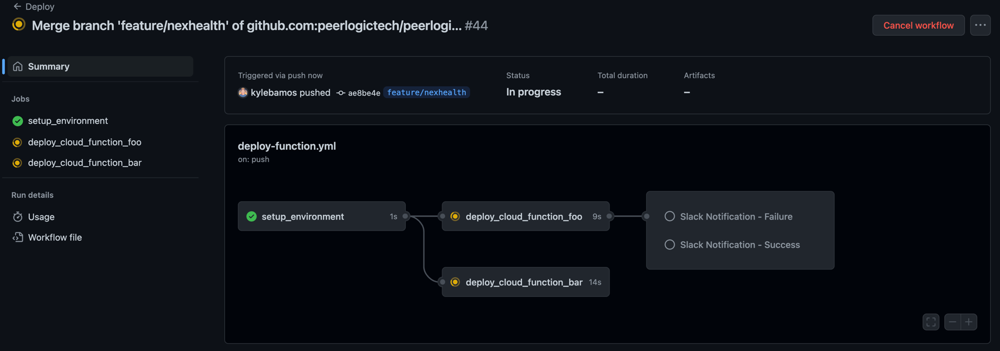
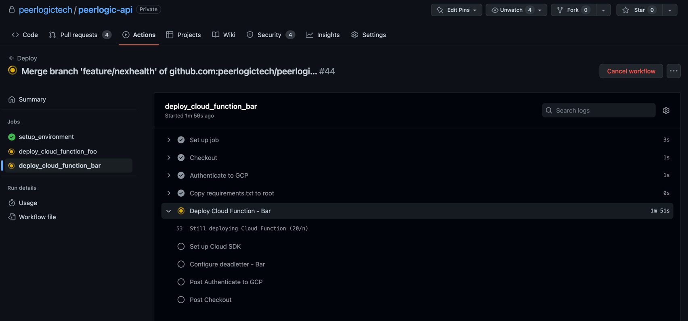
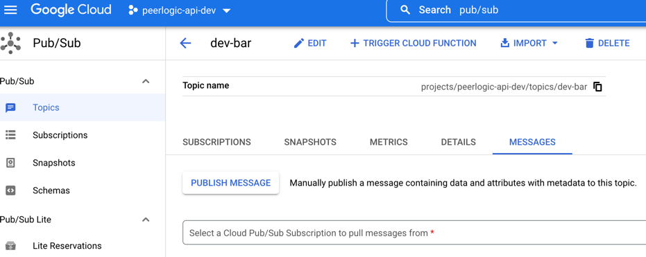
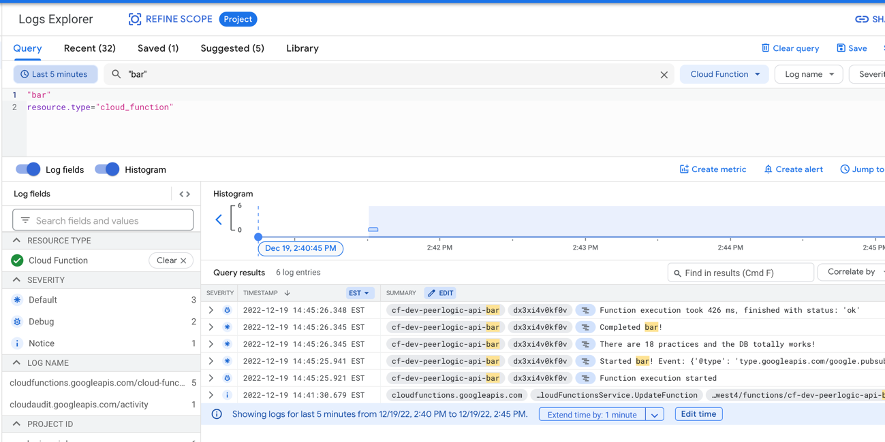

# Cloud Functions

## Overview

We leverage [Cloud Functions](https://cloud.google.com/functions) in this project to perform
asynchronous, potentially long-lived operations with or without robust retry, and triggered
ad hoc, on a schedule or in response to some event ([Pub/Sub](https://cloud.google.com/pubsub), [Cloud Storage Triggers](https://cloud.google.com/functions/docs/readme_images/calling/storage), or [Cloud Function Webhook Targets](https://cloud.google.com/run/docs/readme_images/triggering/webhooks)). For this specific project, more often than not these Cloud Functions will be
performing operations against our [RDBMS](https://cloud.google.com/sql/docs/readme_images/postgres) using the [Django ORM](https://docs.djangoproject.com/en/4.1/topics/db/queries/).

> **THIS GUIDE IS NOT EXHAUSTIVE**
>
> For now, this guide is just going to cover setup for a Cloud Function triggered by Pub/Sub
> with a deadletter topic also setup. For other setups, you'll need to read some docs and
> extrapolate.

## Helpful Links
- [Cloud Functions](https://cloud.google.com/functions)
- [Pub/Sub](https://cloud.google.com/pubsub)
- [GitHub Actions Cloud Function Deploy](https://github.com/google-github-actions/deploy-cloud-functions)
- [Terraform Cloud](https://app.terraform.io/app/peerlogic/workspaces?organization_name=peerlogic)
- [Terraform GitHub for Cloud Functions and Pub/Sub (Dev)](https://github.com/peerlogictech/infrastructure/blob/main/terraform/dev/function.tf)

## Implementation / Anatomy

#### [Entrypoint](../main.py)

Cloud Function entrypoints are python functions with a specific signature in a specific file[^1].
Because of this, we must have a single [main.py](../main.py) file for the entire project which has
the following responsibilities:
1. Set up the Django environment so that we can use the ORM. This includes loading of general configuration.
2. Import and expose entrypoints to Cloud Functions which are defined in their respective app directories.

This file should only be importing code from elsewhere. No functions should be defined here.

#### [GitHub Action Configuration](../main.py)

This is a spicy [YAML](https://yaml.org/) file that configures the [GitHub Action](https://github.com/features/actions) (CI)
for all of our cloud functions.

This file is broken down into jobs and those jobs are broken down into steps:
1. Job runs to initialize variables for use in later jobs
2. Jobs run concurrently for each Cloud Function
   - This is the section that will be modified as you add/remove Cloud Functions
   - These jobs take about 3-5 minutes each and (again) run concurrently. Each job:
      - Checks out the code
      - Authenticates to GCP
      - Copies [requirements.txt](../requirements/requirements.txt) to root directory[^1]
      - Deploys the Cloud Function and configures the [Subscription](https://cloud.google.com/pubsub/docs/readme_images/create-subscription)
      - Configuration for the Cloud Function can be changed when necessary (e.g. memory, timeout, etc.)[^2]
3. Job runs to announce success or failure to Slack

It's worth noting that this file contains some pretty important per-cloud-function configuration that may vary.
More detail is given in our example later, but things like timeout, runtime, instance count, etc. are all controlled
in this YAML file.

#### Actual Logic
The actual logic for Cloud Functions can live in any of the app directories in this project.

Generally, our code should have the following structure:
```
peerlogic-api/
  .github/
  main.py
  app_name/
    cloud_functions/
      __init__.py
      function_name.py
```

The function defined must have the following signature and must info log start and complete:
```py
import logging
from typing import Dict

from peerlogic.decorators import try_catch_log

log = logging.getLogger(__name__)


@try_catch_log
def function_name(event: Dict, context: Dict) -> None:
    log.info(f"Started function_name! Event: {event}, Context: {context}")
    # ... Logic goes here
    log.info("Completed function_name!")
```

## Pub/Sub

> **Terraform is dangerous**
>
> It's best to enlist the help of your friendly neighborhood ops expert if you're not comfortable
> managing infrastructure. This is a much deeper topic than will be covered in this README.


For our Cloud Functions triggered by Pub/Sub, we maintain Pub/Sub topics with [Terraform](https://www.terraform.io/).

These topics are defined here (dev, for example): [Terraform GitHub for Cloud Functions and Pub/Sub (Dev)](https://github.com/peerlogictech/infrastructure/blob/main/terraform/dev/function.tf)

We use [Terraform Cloud](https://app.terraform.io/app/peerlogic/workspaces?organization_name=peerlogic) to actually execute the Terraform.


## Monitoring

- [Generic Cloud Function Grafana Dashboard](https://grafana.peerlogic.com/d/IhhpMVO4k/cloud-functions-monitoring)
- [Generic Pub/Sub Grafana Dashboard](https://grafana.peerlogic.com/d/Lsg3nECnz/pub-sub)
- [Sentry Peerlogic](https://sentry.io/organizations/peerlogic/projects/peerlogic-api/?project=4504255681200128)


## Example of Adding a Cloud Function

Let's add a new Cloud Function to the `core` app!

Our function will be called "bar". This function will:
1. Info log that the function is starting up
2. Count the number of practices in the system and info log that value
3. Info log that the function is finished

We will trigger our function on a Pub/Sub topic, which we are also naming "bar".
Following our best practices, this topic will be backed by a deadletter topic.

### Terraforming

> **NOTE**
>
> As we roll out, we'll need to repeat these terraform steps for other environments.

First, let's start by creating our Pub/Sub topic in [the appropriate terraform file](https://github.com/peerlogictech/infrastructure/commit/e9b95cc5764f6f31a6666050a450a932457a3674):



After that is committed to the appropriate branch for the environment (dev in our case),
we need to apply the change via [Terraform Cloud](https://app.terraform.io/app/peerlogic/workspaces?organization_name=peerlogic).



After the change has been applied, our GCP Pub/Sub topic is created and ready to go:



You'll notice a deadletter topic and subscription were created as well:



### Peerlogic API Code Changes

#### 1. Add the new code

Let's define our cloud function in the `core` app! To do this, we'll create a new python package
in the `core` directory named `cloud_functions`:



Inside this `cloud_functions` directory, we'll
create our `bar.py` file:
```python
import logging
from typing import Dict

from core.models import Practice
from peerlogic.decorators import try_catch_log

log = logging.getLogger(__name__)


@try_catch_log
def bar(event: Dict, context: Dict) -> None:
    """
    Background Cloud Function to be triggered by Pub/Sub.
    """

    log.info(f"Started bar! Event: {event}, Context: {context}")

    practices = Practice.objects.all()
    log.info(f"There are {len(practices)} practices and the DB totally works!")
    log.info(f"Completed bar!")

```

This just defines one function which takes the arguments `event` and `context`. This is the actual code
that will be invoked when an event comes over the wire on our Pub/Sub topic.


#### 2. Expose the new entrypoint

Now that we've added the code we want to execute, let's wire it up. We need to import our newly-created
function above in [main.py](../main.py):
```python
import logging
import os

import django

os.environ.setdefault("DJANGO_SETTINGS_MODULE", "peerlogic.settings")

django.setup()
log = logging.getLogger(__name__)


from core.cloud_functions.bar import bar  # noqa

```

> **NOTE**
>
> The import name of our function is important. This is the name that we will be
> targeting in our next step. If, for instance, you imported `bar as core_bar` or something
> along those lines, you would need to note "core_bar" as the function target for configuration
> going forward.

#### 3. Update the CI configuration

Now that the python code is ready, we need to update our CI configuration to deploy our cloud function
as when we merge and release the code. To do this, we need to add a new job to
[the GitHub Action YML file](../.github/workflows/deploy-function.yml). The job we're adding is best done by
copy+paste+editing an existing Cloud Function deploy job in the file.

1. Copy an existing section from the deploy-function.yml file. Don't just copy out of this README.
2. The job should be called `deploy_cloud_function_<OUR_FUNCTION_NAME>`
3. The job env var `FUNCTION_NAME` should be set to `<OUR_FUNCTION_NAME>`
4. Label the "deploy" step as `Deploy Cloud Function - <OUR_FUNCTION_NAME>`
5. Label the "deadletter" step as `Configure deadletter - <OUR_FUNCTION_NAME>`
6. Adjust any necessary configuration. Some common params you might want to change include:
  - `event_trigger_type` and `event_trigger_resource` if not using Pub/Sub
  - `max_instances`
  - `memory_mb`
  - `timeout`


```yml
  deploy_cloud_function_bar:
    runs-on: ubuntu-latest
    needs: setup_environment
    permissions:
      contents: 'read'
      id-token: 'write'
    env:
      FUNCTION_NAME: bar

    steps:
      - name: Checkout
        uses: actions/checkout@v3

      - name: Authenticate to GCP
        id: auth
        uses: google-github-actions/auth@v0
        with:
          workload_identity_provider: "projects/${{ needs.setup_environment.outputs.gcp_project }}/locations/global/workloadIdentityPools/${{ needs.setup_environment.outputs.base_name }}/providers/${{ needs.setup_environment.outputs.base_name }}"
          service_account: "github-sa@peerlogic-api-${{ needs.setup_environment.outputs.gcp_env }}.iam.gserviceaccount.com"

      - name: Copy requirements.txt to root
        run: |
          cp requirements/requirements.txt requirements.txt

      - name: Deploy Cloud Function - Bar
        uses: 'google-github-actions/deploy-cloud-functions@v0'
        with:
          build_environment_variables: "ALLOWED_HOSTS=localhost ,DJANGO_SECRET_KEY=foo"
          deploy_timeout: 900
          entry_point: ${{ env.FUNCTION_NAME }}
          env_vars: "REGION=${{ needs.setup_environment.outputs.region }},GOOGLE_CLOUD_PROJECT=peerlogic-api-${{ needs.setup_environment.outputs.gcp_env }}"
          event_trigger_resource: projects/peerlogic-api-${{ needs.setup_environment.outputs.gcp_env }}/topics/${{ needs.setup_environment.outputs.gcp_env }}-${{ env.FUNCTION_NAME }}
          event_trigger_retry: true
          event_trigger_type: google.pubsub.topic.publish
          max_instances: 1
          memory_mb: 512
          name: "cf-${{ needs.setup_environment.outputs.gcp_env }}-${{ needs.setup_environment.outputs.base_name }}-${{ env.FUNCTION_NAME }}"
          project_id: "peerlogic-api-${{ needs.setup_environment.outputs.gcp_env }}"
          region: "${{ needs.setup_environment.outputs.region }}"
          runtime: 'python39'
          source_dir: .
          timeout: 540
          vpc_connector: "projects/peerlogic-api-${{ needs.setup_environment.outputs.gcp_env }}/locations/${{ needs.setup_environment.outputs.region }}/connectors/peerlogic-api-${{ needs.setup_environment.outputs.gcp_env }}"

      - name: 'Set up Cloud SDK'
        uses: 'google-github-actions/setup-gcloud@v0'

      - name: Configure deadletter - Bar
        run: |
          gcloud pubsub subscriptions update \
          "gcf-cf-${{ needs.setup_environment.outputs.gcp_env }}-${{ needs.setup_environment.outputs.base_name }}-${{ env.FUNCTION_NAME }}-${{ needs.setup_environment.outputs.region }}-${{ needs.setup_environment.outputs.gcp_env }}-${{ env.FUNCTION_NAME }}" \
          --dead-letter-topic="${{ needs.setup_environment.outputs.gcp_env }}-${{ env.FUNCTION_NAME }}-failed" \
          --dead-letter-topic-project="peerlogic-api-${{ needs.setup_environment.outputs.gcp_env }}" \
          --max-delivery-attempts=6 \
          --min-retry-delay=2m
```

After you're added your new job, you need to modify the two Slack notification jobs
at the bottom of the YAML file to include your new job name in their `needs` field.

Example:
```yaml
  ...

  slackSuccessNotification:
    needs: [setup_environment, deploy_cloud_bar]
    runs-on: ubuntu-latest

  ...

  slackFailureNotification:
    needs: [setup_environment, deploy_cloud_bar]
    runs-on: ubuntu-latest

  ...
```

#### 4. Deploying

Once our code is merged to the `development` branch, the GitHub action should run and deploy our cloud function:






#### 5. Verifying

Now that our function has deployed, we can publish a message to our Pub/Sub topic to test it!

Let's go to our Pub/Sub topic in the GCP console and use the `Publish Message` button on the `Messages` tab for the topic:



For the message body, let's just send `{}`. No attributes or anything else. Defaults are fine.

After we've published our message, we can make sure it worked by checking logs:



[^1]: https://cloud.google.com/functions/docs/readme_images/writing#directory-structure-python
[^2]: https://github.com/google-github-actions/deploy-cloud-functions
